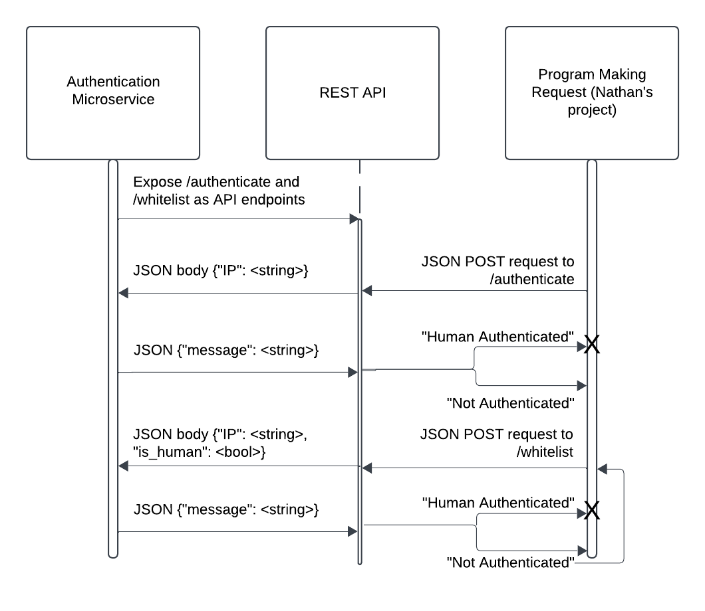

# Authentication Microservice

Details on how to use and interact with the microservice.

This [microservice](https://auth-microservice-f2768dc2c490.herokuapp.com) is hosted on Heroku. The service is a simple API server with two unique POST endpoints:

- /authenticate: used for verifying whether or not a particular client is authenticated to use the site
- /whitelist: adds a new client (IP address or username) to the authentication db

## REQUEST Data

To request data from the api, you must make a POST request to one of its API endpoints, depending on the circumstance.

Here is an example requesting data from the /authenticate endpoint:

```
  const checkIfHuman = async () => {
    const response = await fetch(`https://auth-microservice-f2768dc2c490.herokuapp.com/authenticate`, {
      method: "POST",
      body: JSON.stringify({"IP": IP}),  // This can be an IP address or username, but must use the key "IP"
      headers: { "Content-Type": "application/json" }
    });
    if (response.status === 200) {
      console.log(`Information posted.`);
      const responseData = await response.json()
      console.log(responseData);
      if (responseData.message === "Not authenticated") {
        setAuth(false);
      } else if (responseData.message === "Human authenticated") {
        setAuth(true);
      }
    } else {
      const errMessage = await response.json();
      console.log(
        `Unable to post information: ${response.status}. ${errMessage.Error}`
      );
    }
  }
```

Here is an example requesting data from the /whitelist endpoint:

```
 const handleAuthentication = async () => {
    const response = await fetch(`https://auth-microservice-f2768dc2c490.herokuapp.com/whitelist`, {
      method: "POST",
      body: JSON.stringify({"IP": IP, "is_human": true}),  // body message must include an "IP" key and an "is_human" bool val
      headers: { "Content-Type": "application/json" }
    });
    if (response.status === 200) {
      console.log(`Information posted.`);
      const responseData = await response.json()
      console.log(responseData);
      if (responseData.message === "Not authenticated") {
        setAuth(false);
      } else if (responseData.message === "Human authenticated") {
        setAuth(true);
      }
    } else {
      const errMessage = await response.json();
      console.log(
        `Unable to post information: ${response.status}. ${errMessage.Error}`
      );
    }
  }
```

## RECEIVE Data

Both API endpoints will return data to the user automatically and in the same format.
The data returned will be one of two strings:

- "Human authenticated"
- "Not authenticated"

In the case of receiving data from the /authenticate endpoint, "Human authenticated" indicates that the
user is already authenticated to use the site and does not need to log in again. "Not authenticated"
indicates that the user does not have their credentials stored and will need to complete the login process.

In the case of received data from the /whitelist endpoint, "Human authenticated" indicates that
the users credentials have been stored for future use and they have been logged in. "Not authenticated"
indicates that a new user did not provide the proper credentials (POSTed a False value for their "is_human" attribute).

## UML Sequence Diagram


